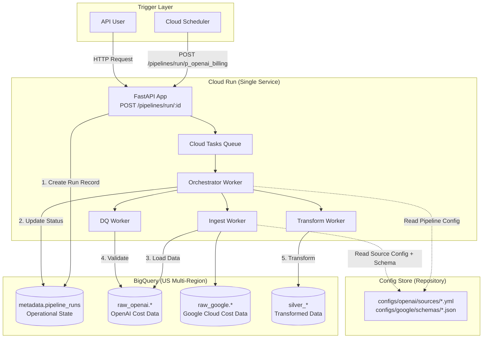
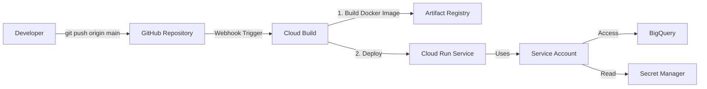

# Convergence Data Pipeline

## Technical Executive Summary

Convergence Data Pipeline is an enterprise-grade, **multi-tenant** data ingestion platform designed to unify disparate cost and utilization data streams from multiple cloud and AI providers (OpenAI, Claude, Google) into a central **BigQuery data lake**.

This project is built on four core principles:

1. **Multi-Tenant Architecture**: Complete tenant isolation with auto-provisioning of metadata infrastructure
2. **Config-as-Code (CaC) Framework**: Engineers define source configs, data quality (DQ) rules, and pipeline workflows in declarative YAML files stored in the repository
3. **Decoupled Worker Architecture**: The system is broken into a lightweight Control Plane (API) and a scalable Data Plane (Async Workers), all deployed as a **single FastAPI application on Cloud Run**
4. **Observable & Reliable by Design**: Built-in state management, distributed tracing, and structured metadata logging using **BigQuery as the operational database**

---

## Multi-Tenant Metadata Architecture

Each tenant gets their own isolated metadata infrastructure that is **automatically created** on first pipeline execution:

```
{project_id}/
├── {tenant_id}_metadata/          # Tenant-specific metadata (e.g., acme1281_metadata)
│   ├── api_keys                   # Tenant's API keys
│   ├── pipeline_runs              # Pipeline execution tracking
│   ├── step_logs                  # Detailed step-by-step logs
│   └── dq_results                 # Data quality validation results
│
├── {tenant_id}_raw_openai/        # Tenant's OpenAI data
├── {tenant_id}_raw_google/        # Tenant's Google Cloud data
└── {tenant_id}_silver_cost/       # Tenant's transformed data
```

### Key Features

- **Auto-Initialization**: Metadata infrastructure is automatically created when a tenant runs their first pipeline
- **Configuration-Driven**: All table schemas defined in `configs/metadata/schemas/` as JSON files
- **Complete Isolation**: Each tenant's data and metadata are completely isolated
- **JSON Type Support**: Flexible parameter and metadata storage using BigQuery JSON type
- **No Manual Setup**: Zero manual configuration required for new tenants
- **Development Mode**: Authentication can be disabled for local development (`DISABLE_AUTH=true`)

**Documentation**: See [`docs/metadata-schema.md`](docs/metadata-schema.md) for complete schema reference.

---

## GCP-Native Architecture

This platform is **100% Google Cloud Platform (GCP)** native with no external databases or orchestrators:

| Component | GCP Service | Purpose |
|-----------|-------------|---------|
| **Compute** | Cloud Run | Single FastAPI service (API + async workers) |
| **Data Lake** | BigQuery (US multi-region) | All data storage including operational metadata |
| **Orchestration** | Cloud Scheduler | Triggers pipelines via HTTP POST |
| **Message Queue** | Cloud Tasks / Pub/Sub | Async task distribution to workers |
| **Secrets** | Cloud Secret Manager | API keys, service account keys |
| **Config Storage** | Repository (configs/) | Version-controlled YAML configs |
| **Schema Definitions** | Repository (configs/) | BigQuery schemas as JSON files |
| **Deployment** | Cloud Build | CI/CD triggered by GitHub push to `main` |
| **Authentication** | Service Accounts | Both local (`~/gcp/*.json`) and Cloud Run |
| **Monitoring** | Cloud Logging + Error Reporting | Structured JSON logs with trace correlation |

### Architecture Diagram



---

## Core Technical Stack

### Application Layer
- **FastAPI**: Async HTTP API + background task orchestration
- **Celery** or **Arq**: Async worker framework (backed by Redis or Cloud Tasks)
- **Pydantic**: Config validation and data modeling
- **Polars**: High-performance in-memory data transformations (replaces Pandas)

### Data Layer (100% BigQuery)
- **BigQuery Python Client**: All DDL, DML, schema management
- **Datasets**: Domain-based (`raw_openai`, `raw_google`, `silver_`, `gold_`, `metadata`)
- **Location**: `US` (multi-region for high availability)
- **Partitioning**: All raw tables partitioned by `ingestion_date` (DATE column)

### Observability
- **Cloud Logging**: Structured JSON logs with `trace_id` injection
- **OpenTelemetry**: Distributed tracing across API → Workers → BigQuery
- **Error Reporting**: Automatic exception tracking

---

## BigQuery Schema Management

### Schema Definition Strategy

All BigQuery schemas are defined as **JSON files** in the repository under `configs/{domain}/schemas/`:

```
configs/
├── openai/
│   ├── sources/
│   │   └── billing_usage.yml        # Ingest config references schema below
│   └── schemas/
│       └── focus_cost.json          # BigQuery schema definition
├── google/
│   ├── sources/
│   │   └── cloud_billing.yml
│   └── schemas/
│       └── billing_export.json
└── metadata/
    └── schemas/
        └── pipeline_runs.json       # Operational metadata table
```

### Schema File Format

Example: `configs/openai/schemas/focus_cost.json`

```json
[
  {
    "name": "billing_date",
    "type": "DATE",
    "mode": "REQUIRED",
    "description": "The date of the billing record"
  },
  {
    "name": "organization_id",
    "type": "STRING",
    "mode": "REQUIRED"
  },
  {
    "name": "usage_amount",
    "type": "FLOAT64",
    "mode": "NULLABLE"
  },
  {
    "name": "cost_usd",
    "type": "NUMERIC",
    "mode": "REQUIRED",
    "description": "Total cost in USD (precision: 2 decimal places)"
  },
  {
    "name": "ingestion_date",
    "type": "DATE",
    "mode": "REQUIRED",
    "description": "Partition column for table partitioning"
  },
  {
    "name": "ingestion_timestamp",
    "type": "TIMESTAMP",
    "mode": "REQUIRED",
    "description": "When this record was ingested"
  }
]
```

### Schema Application via Python Client

The **Ingest Worker** applies schemas programmatically using the BigQuery Python client:

```python
from google.cloud import bigquery

def create_or_update_table(dataset_id: str, table_id: str, schema_path: str):
    """
    Creates or updates a BigQuery table with schema from JSON file.

    Args:
        dataset_id: e.g., "raw_openai"
        table_id: e.g., "usage_logs"
        schema_path: e.g., "configs/openai/schemas/focus_cost.json"
    """
    client = bigquery.Client()

    # Load schema from JSON file
    with open(schema_path) as f:
        schema_json = json.load(f)

    schema = [bigquery.SchemaField.from_api_repr(field) for field in schema_json]

    # Define table with partitioning
    table_ref = f"{client.project}.{dataset_id}.{table_id}"
    table = bigquery.Table(table_ref, schema=schema)

    # Partition by ingestion_date
    table.time_partitioning = bigquery.TimePartitioning(
        type_=bigquery.TimePartitioningType.DAY,
        field="ingestion_date"
    )

    # Create or update table (idempotent)
    table = client.create_table(table, exists_ok=True)

    return table
```

### Schema Versioning

- **No Alembic/Migration Tool**: Schemas are managed via **idempotent DDL** in Python
- **Schema Evolution**:
  - Add new columns: Use `ALTER TABLE` via BigQuery client
  - Breaking changes: Create new table with version suffix (`usage_logs_v2`)
- **Git as Source of Truth**: All schema changes committed to `main` branch

---

## Pipeline State Management (BigQuery)

### The `metadata.pipeline_runs` Table

All pipeline execution state is stored in **BigQuery** (not Postgres/Firestore):

**DDL** (applied via Python client at deployment):

```sql
CREATE TABLE IF NOT EXISTS `{project_id}.metadata.pipeline_runs` (
  pipeline_logging_id STRING NOT NULL,         -- UUID for this specific run
  pipeline_id STRING NOT NULL,                 -- e.g., "p_openai_billing"
  status STRING NOT NULL,                      -- PENDING, INGESTING, VALIDATING, TRANSFORMING, FAILED, COMPLETE
  trigger_type STRING,                         -- api, scheduler, manual
  trigger_by STRING,                           -- service-account@project.iam.gserviceaccount.com
  start_time TIMESTAMP NOT NULL,
  end_time TIMESTAMP,
  duration_ms INT64,
  run_metadata JSON,                           -- Detailed step-by-step execution log
  error_message STRING,                        -- Full stack trace if failed
  ingestion_date DATE NOT NULL                 -- Partition column
)
PARTITION BY ingestion_date
CLUSTER BY pipeline_id, status;
```

### `run_metadata` JSON Structure

The `run_metadata` column stores detailed execution steps:

```json
{
  "steps": [
    {
      "name": "ingest_raw",
      "status": "COMPLETE",
      "start_time": "2024-11-14T10:00:00Z",
      "duration_ms": 120450,
      "metadata": {
        "type": "rest_api",
        "rows_ingested": 1500,
        "api_calls": 30,
        "source_config": "openai/sources/billing_usage.yml"
      }
    },
    {
      "name": "validate_raw",
      "status": "COMPLETE",
      "start_time": "2024-11-14T10:02:01Z",
      "duration_ms": 30100,
      "metadata": {
        "expectations_passed": 20,
        "expectations_failed": 1,
        "failed_rows_percent": 0.05,
        "dq_config": "openai/dq_rules/billing_dq.yml"
      }
    }
  ],
  "config_version": "abc123def",               -- Git commit SHA of configs
  "worker_instance": "cloudrun-worker-xyz"
}
```

### Querying Pipeline State

Example queries for operational monitoring:

```sql
-- Find all failed pipelines in last 24 hours
SELECT pipeline_id, pipeline_logging_id, error_message, start_time
FROM `project.metadata.pipeline_runs`
WHERE status = 'FAILED'
  AND start_time > TIMESTAMP_SUB(CURRENT_TIMESTAMP(), INTERVAL 24 HOUR)
ORDER BY start_time DESC;

-- Average duration by pipeline
SELECT
  pipeline_id,
  ROUND(AVG(duration_ms) / 1000, 2) as avg_duration_seconds,
  COUNT(*) as total_runs
FROM `project.metadata.pipeline_runs`
WHERE status = 'COMPLETE'
  AND ingestion_date >= CURRENT_DATE() - 7
GROUP BY pipeline_id;
```

---

## Dataset Organization

### Multi-Tenant Dataset Structure

BigQuery datasets are organized by **tenant and data source domain** for complete tenant isolation:

```
{project_id}.{tenant_id}_metadata.*       # Tenant metadata (auto-created)
{project_id}.{tenant_id}_raw_openai.*     # Tenant's OpenAI data
{project_id}.{tenant_id}_raw_google.*     # Tenant's Google Cloud data
{project_id}.{tenant_id}_raw_anthropic.*  # Tenant's Claude data
{project_id}.{tenant_id}_silver_cost.*    # Tenant's normalized cost data
{project_id}.{tenant_id}_gold_reporting.* # Tenant's business reports
```

**Example for tenant `acme1281`:**
```
gac-prod-471220.acme1281_metadata.*
gac-prod-471220.acme1281_raw_openai.*
gac-prod-471220.acme1281_raw_google.*
gac-prod-471220.acme1281_silver_cost.*
```

### Table Naming Conventions

- **Metadata**: `{tenant_id}_metadata.{table}` → `acme1281_metadata.pipeline_runs`
- **Raw Layer**: `{tenant_id}_raw_{provider}.{entity}` → `acme1281_raw_openai.usage_logs`
- **Silver Layer**: `{tenant_id}_silver_{domain}.{entity}` → `acme1281_silver_cost.unified_daily`
- **Gold Layer**: `{tenant_id}_gold_{business_area}.{report}` → `acme1281_gold_reporting.monthly_spend`

### Standard Table Features

All raw tables include:
- **Partitioning**: By `ingestion_date` (DATE column, day granularity)
- **Clustering**: By frequently filtered columns (e.g., `organization_id`, `project_id`)
- **Metadata Columns**:
  - `ingestion_date DATE` (partition key)
  - `ingestion_timestamp TIMESTAMP` (exact load time)
  - `pipeline_logging_id STRING` (links to `metadata.pipeline_runs`)

---

## Pipeline Configuration Structure

The Convergence Data Pipeline uses a **pipeline-as-config** approach where each pipeline is completely self-contained in its own folder with all configuration files co-located.

### Directory Structure

Pipelines are organized under: `configs/{tenant_id}/{cloud_provider}/{domain}/{pipeline_name}/`

Each pipeline folder contains:
- **Pipeline YAML** - Main pipeline configuration
- **DQ Config YAML** - Data quality rules
- **Output Schema JSON** - BigQuery table schema definition

**Current Structure:**
```
configs/acme1281/gcp/cost/
├── gcp_billing_export/
│   ├── gcp_billing_export.yml                    # Pipeline config
│   ├── gcp_billing_export_dq.yml                 # Data quality rules
│   └── gcp_billing_export_output_schema.json     # Output table schema
│
└── gcp_pricing_calculation/
    ├── gcp_pricing_calculation.yml               # Pipeline config
    ├── gcp_pricing_calculation_dq.yml            # Data quality rules
    ├── gcp_pricing_calculation_raw_output_schema.json    # Raw output schema
    └── gcp_pricing_calculation_final_output_schema.json  # Final output schema
```

### Key Principles

1. **Self-Contained Pipelines**: Each pipeline folder contains ALL its configuration files - no external dependencies or shared configs (except metadata schemas).

2. **Relative Path References**: All paths in pipeline YAMLs are relative to the pipeline folder:
   ```yaml
   dq_config: "gcp_billing_export_dq.yml"          # Not full path
   schema_file: "gcp_billing_export_output_schema.json"
   ```

3. **Dynamic Discovery**: System finds pipelines automatically using glob pattern `**/{pipeline_id}.yml` - no central registration needed.

4. **Schema-Driven Tables**: Output tables are created from JSON schema files, ensuring consistency between config and actual table structure.

### Pipeline YAML Structure

Each pipeline YAML defines source queries, transformations, and destinations:

```yaml
pipeline_id: gcp_billing_export
source:
  type: bigquery
  project_id: gac-prod-471220
  dataset: billing
  table: gcp_billing_export_v1_*

destination:
  dataset_type: gcp
  table: example_output
  write_mode: overwrite
  recreate: true
  schema_file: "gcp_billing_export_output_schema.json"  # Relative path

dq_config: "gcp_billing_export_dq.yml"  # Relative path
```

### Output Schema Files

Schema files define BigQuery table structure in JSON format:

```json
[
  {
    "name": "billing_account_id",
    "type": "STRING",
    "mode": "NULLABLE",
    "description": "Billing account identifier"
  },
  {
    "name": "cost",
    "type": "FLOAT64",
    "mode": "NULLABLE",
    "description": "Cost amount"
  },
  {
    "name": "ingestion_date",
    "type": "DATE",
    "mode": "REQUIRED",
    "description": "Date when data was ingested (partition key)"
  }
]
```

### Triggering Pipelines

Trigger by pipeline ID - system finds config automatically:

```bash
curl -X POST http://localhost:8000/pipelines/run/gcp_billing_export \
  -H "Content-Type: application/json"
```

### Adding New Pipelines

1. Create new folder: `configs/{tenant}/{cloud}/{domain}/{pipeline_name}/`
2. Add pipeline YAML: `{pipeline_name}.yml`
3. Add DQ config: `{pipeline_name}_dq.yml`
4. Add output schema: `{pipeline_name}_output_schema.json`
5. Use relative paths in YAML
6. Trigger pipeline - no registration needed

For detailed configuration guide, see [`docs/pipeline-configuration.md`](docs/pipeline-configuration.md).

---

## Local Development Setup

### Prerequisites

1. **Python 3.11+**
2. **GCP Service Account** with permissions:
   - BigQuery Data Editor
   - BigQuery Job User
   - Secret Manager Secret Accessor
3. **Service Account Key** stored at `~/gcp/{your-service-account}.json`

### Setup Steps

```bash
# 1. Clone repository
git clone https://github.com/your-org/convergence-data-pipeline.git
cd convergence-data-pipeline

# 2. Create virtual environment
python3.11 -m venv venv
source venv/bin/activate

# 3. Install dependencies
pip install -r requirements.txt

# 4. Set environment variables
export GOOGLE_APPLICATION_CREDENTIALS="/Users/gurukallam/.gcp/gac-prod-471220-e34944040b62.json"
export GCP_PROJECT_ID="gac-prod-471220"
export BIGQUERY_LOCATION="US"

# 5. Verify BigQuery access
python -c "from google.cloud import bigquery; print(bigquery.Client().project)"

# 6. Initialize metadata tables (one-time setup)
python scripts/init_metadata_tables.py

# 7. Run FastAPI locally
uvicorn app.main:app --reload --port 8000
```

### Running Workers Locally

```bash
# Terminal 1: Start Redis (for Celery)
docker run -d -p 6379:6379 redis:7-alpine

# Terminal 2: Start Celery worker
celery -A core.workers.celery_app worker --loglevel=info

# Terminal 3: Start FastAPI
uvicorn app.main:app --reload
```

### Testing a Pipeline Locally

```bash
# Trigger a pipeline via API
curl -X POST http://localhost:8000/pipelines/run/p_openai_billing \
  -H "Content-Type: application/json" \
  -d '{"trigger_by": "user:dev@example.com"}'

# Check pipeline status
curl http://localhost:8000/pipelines/runs/{pipeline_logging_id}
```

---

## Deployment (GitHub → Cloud Build → Cloud Run)

### Deployment Architecture



### Repository Files

```
.
├── cloudbuild.yaml          # Cloud Build configuration
├── Dockerfile               # Multi-stage build for FastAPI app
├── requirements.txt         # Python dependencies
├── app/                     # FastAPI application
├── core/                    # Workers and business logic
└── configs/                 # YAML/JSON configs (deployed in container)
```

### `cloudbuild.yaml`

```yaml
steps:
  # Step 1: Build Docker image
  - name: 'gcr.io/cloud-builders/docker'
    args:
      - 'build'
      - '-t'
      - 'us-docker.pkg.dev/${PROJECT_ID}/convergence/api:${SHORT_SHA}'
      - '-t'
      - 'us-docker.pkg.dev/${PROJECT_ID}/convergence/api:latest'
      - '.'

  # Step 2: Push image to Artifact Registry
  - name: 'gcr.io/cloud-builders/docker'
    args:
      - 'push'
      - '--all-tags'
      - 'us-docker.pkg.dev/${PROJECT_ID}/convergence/api'

  # Step 3: Deploy to Cloud Run
  - name: 'gcr.io/google.com/cloudsdktool/cloud-sdk'
    entrypoint: gcloud
    args:
      - 'run'
      - 'deploy'
      - 'convergence-api'
      - '--image=us-docker.pkg.dev/${PROJECT_ID}/convergence/api:${SHORT_SHA}'
      - '--region=us-central1'
      - '--platform=managed'
      - '--service-account=convergence-api@${PROJECT_ID}.iam.gserviceaccount.com'
      - '--set-env-vars=GCP_PROJECT_ID=${PROJECT_ID},BIGQUERY_LOCATION=US'
      - '--allow-unauthenticated'  # Change to --no-allow-unauthenticated for prod
      - '--memory=2Gi'
      - '--cpu=2'
      - '--concurrency=80'
      - '--max-instances=10'

timeout: 1200s
options:
  machineType: 'N1_HIGHCPU_8'
```

### `Dockerfile`

```dockerfile
# Multi-stage build for smaller image size
FROM python:3.11-slim as builder

WORKDIR /build
COPY requirements.txt .
RUN pip install --user --no-cache-dir -r requirements.txt

# Runtime stage
FROM python:3.11-slim

WORKDIR /app

# Copy dependencies from builder
COPY --from=builder /root/.local /root/.local

# Copy application code
COPY app/ ./app/
COPY core/ ./core/
COPY configs/ ./configs/

# Add local bin to PATH
ENV PATH=/root/.local/bin:$PATH

# Run FastAPI with Uvicorn
CMD ["uvicorn", "app.main:app", "--host", "0.0.0.0", "--port", "8080"]
```

### Triggering Deployment

**Automatic (on push to `main`):**
```bash
git add .
git commit -m "Add new OpenAI pipeline"
git push origin main
# Cloud Build automatically triggered via GitHub App webhook
```

**Manual (Cloud Build trigger):**
```bash
gcloud builds submit --config=cloudbuild.yaml
```

### Cloud Run Service Configuration

The deployed service has:
- **Service Account**: `convergence-api@{project}.iam.gserviceaccount.com`
- **IAM Bindings**:
  - `roles/bigquery.dataEditor` (create/update tables)
  - `roles/bigquery.jobUser` (run queries)
  - `roles/secretmanager.secretAccessor` (read API keys)
- **Environment Variables**:
  - `GCP_PROJECT_ID`: Target BigQuery project
  - `BIGQUERY_LOCATION`: `US`
  - `LOG_LEVEL`: `INFO`

---

## Configuration Management

### Config Store Structure

All configs live in the **repository** (not GCS) and are deployed with the Docker image:

```
configs/
├── pipelines/
│   ├── p_openai_billing.yml       # Pipeline orchestration
│   └── p_google_billing.yml
├── openai/
│   ├── sources/
│   │   └── billing_usage.yml      # Ingest config
│   ├── schemas/
│   │   └── focus_cost.json        # BigQuery schema
│   └── dq_rules/
│       └── billing_dq.yml         # Data quality expectations
└── google/
    ├── sources/
    │   └── cloud_billing_export.yml
    ├── schemas/
    │   └── billing_export.json
    └── dq_rules/
        └── billing_dq.yml
```

### Secret Management (Cloud Secret Manager)

API keys and credentials are stored in **Secret Manager**, not in configs:

```yaml
# configs/openai/sources/billing_usage.yml
source_id: openai_billing_daily
domain: openai

connector:
  type: rest_api
  base_url: "https://api.openai.com/v1"
  endpoint: "/usage"
  auth:
    type: bearer
    secret_key: "openai_api_key"  # <-- References Secret Manager secret name

loading:
  destination: "raw_openai.usage_logs"
  strategy: "merge"
  keys: ["billing_date", "organization_id"]
```

**Reading secrets in workers:**

```python
from google.cloud import secretmanager

def get_secret(secret_name: str) -> str:
    """Fetch secret from Secret Manager."""
    client = secretmanager.SecretManagerServiceClient()
    name = f"projects/{PROJECT_ID}/secrets/{secret_name}/versions/latest"
    response = client.access_secret_version(request={"name": name})
    return response.payload.data.decode("UTF-8")

# Usage
api_key = get_secret("openai_api_key")
```

---

## Config-as-Code Examples

### 1. Pipeline Config (`configs/pipelines/p_openai_billing.yml`)

```yaml
pipeline_id: p_openai_billing
description: "E2E pipeline for OpenAI billing data"
schedule: "0 4 * * *"  # Daily at 4 AM UTC (for Cloud Scheduler cron)

steps:
  - name: "ingest_raw"
    type: "ingest"
    source_config: "openai/sources/billing_usage.yml"
    on_failure: "stop"

  - name: "validate_raw"
    type: "dq_check"
    target_table: "raw_openai.usage_logs"
    rules_config: "openai/dq_rules/billing_dq.yml"
    on_failure: "alert"

  - name: "transform_silver"
    type: "transform"
    sql_file: "sql/silver/openai_daily_cost.sql"
    destination: "silver_cost.openai_daily"
    on_failure: "stop"
```

### 2. Source Config (`configs/openai/sources/billing_usage.yml`)

```yaml
source_id: openai_billing_daily
domain: openai
description: "Ingests daily billing breakdown from OpenAI API"

connector:
  type: rest_api
  base_url: "https://api.openai.com/v1"
  endpoint: "/usage"
  auth:
    type: bearer
    secret_key: "openai_api_key"
  pagination:
    type: "cursor"
    cursor_field: "next_page_token"
  rate_limit:
    requests_per_minute: 60

loading:
  destination: "raw_openai.usage_logs"
  schema_file: "openai/schemas/focus_cost.json"  # <-- BigQuery schema
  strategy: "merge"
  merge_keys: ["billing_date", "organization_id"]
  partition_field: "ingestion_date"
```

### 3. Data Quality Config (`configs/openai/dq_rules/billing_dq.yml`)

```yaml
dq_id: openai_billing_quality_checks
target_table: "raw_openai.usage_logs"
description: "Validates OpenAI billing data quality"

expectations:
  - name: "no_null_billing_dates"
    type: "expect_column_values_to_not_be_null"
    column: "billing_date"
    severity: "critical"

  - name: "valid_cost_range"
    type: "expect_column_values_to_be_between"
    column: "cost_usd"
    min_value: 0
    max_value: 100000
    severity: "warning"

  - name: "recent_data_check"
    type: "expect_table_row_count_to_be_between"
    min_value: 1
    max_value: null
    filter: "billing_date = CURRENT_DATE() - 1"
    severity: "critical"
```

---

## Enterprise Architecture & Scaling

### How This Scales

**Control Plane (FastAPI)**:
- Handles API requests, auth, and dispatching jobs to message queue
- Scales via Cloud Run **concurrency** (80 concurrent requests per instance)
- Scales via Cloud Run **max instances** (up to 10 instances)
- Does **no heavy lifting** (just creates tasks and returns)

**Data Plane (Workers)**:
- All workers run in the **same Cloud Run service** (single codebase)
- Scale **horizontally** via Cloud Run instances based on:
  - Cloud Tasks queue depth
  - CPU/memory utilization
- Workers are **stateless** (all state in BigQuery)

**BigQuery**:
- **On-demand pricing**: No slot reservation needed initially
- **Partitioning**: All raw tables partitioned by `ingestion_date` (reduces query costs)
- **Clustering**: Secondary clustering on high-cardinality columns (e.g., `organization_id`)
- **Streaming Inserts**: For real-time use cases (higher cost)
- **Batch Inserts**: For scheduled pipelines (cost-effective)

### Cost Optimization

1. **Partition Pruning**: Always filter on `ingestion_date` in queries
2. **Clustering**: Cluster on frequently filtered columns
3. **Materialized Views**: For expensive aggregations (silver → gold)
4. **Cloud Run Auto-scaling**: Min instances = 0 (scale to zero when idle)
5. **BigQuery Caching**: Enable query result caching (24-hour TTL)

---

## Observability & Monitoring

### 1. Structured Logging

All logs are JSON-formatted and sent to **Cloud Logging**:

```python
import logging
import json
from opentelemetry import trace

# Configure JSON logging
logging.basicConfig(
    format='%(message)s',
    level=logging.INFO
)

def log_structured(message: str, **kwargs):
    """Log structured JSON to Cloud Logging."""
    tracer = trace.get_current_span()
    log_entry = {
        "message": message,
        "trace_id": f"{tracer.get_span_context().trace_id:032x}",
        "severity": "INFO",
        **kwargs
    }
    logging.info(json.dumps(log_entry))

# Usage
log_structured(
    "Pipeline started",
    pipeline_id="p_openai_billing",
    pipeline_logging_id="abc-123-def",
    trigger_by="cloud-scheduler"
)
```

### 2. Distributed Tracing

Using **OpenTelemetry** to trace requests across API → Workers → BigQuery:

```python
from opentelemetry import trace
from opentelemetry.exporter.cloud_trace import CloudTraceSpanExporter
from opentelemetry.sdk.trace import TracerProvider
from opentelemetry.sdk.trace.export import BatchSpanProcessor

# Setup (in app startup)
tracer_provider = TracerProvider()
cloud_trace_exporter = CloudTraceSpanExporter()
tracer_provider.add_span_processor(BatchSpanProcessor(cloud_trace_exporter))
trace.set_tracer_provider(tracer_provider)

# Usage in worker
tracer = trace.get_tracer(__name__)

with tracer.start_as_current_span("ingest_openai_billing") as span:
    span.set_attribute("pipeline_id", "p_openai_billing")
    span.set_attribute("rows_ingested", 1500)
    # ... perform ingestion
```

### 3. Monitoring Dashboards

**Cloud Monitoring Metrics**:
- **Cloud Run**: Request latency, error rate, instance count
- **BigQuery**: Slot utilization, query duration, bytes processed
- **Custom Metrics**: Pipeline success rate, data quality failures

**Alerts**:
- Pipeline failure (status = 'FAILED' in `pipeline_runs`)
- Data quality degradation (DQ expectations failing)
- Cloud Run error rate > 5%
- BigQuery query costs > threshold

---

## Project Structure

```
convergence-data-pipeline/
│
├── app/                        # === CONTROL PLANE (FastAPI) ===
│   ├── routers/
│   │   ├── pipeline_runs.py    # POST /pipelines/run/{id}
│   │   ├── webhooks.py         # Webhook handlers
│   │   └── health.py           # /health endpoint
│   ├── core_services.py        # Singleton clients (BigQuery, Secret Manager)
│   ├── logging_config.py       # Structured JSON logging setup
│   └── main.py                 # FastAPI app entrypoint
│
├── core/                       # === CORE LOGIC & DATA PLANE ===
│   ├── abstractor/             # Config parsers (Pydantic models)
│   │   ├── pipeline_config.py
│   │   ├── source_config.py
│   │   └── dq_config.py
│   ├── engine/                 # Reusable business logic
│   │   ├── bq_loader.py        # BigQuery table creation + loading
│   │   ├── api_connector.py    # REST API fetching
│   │   ├── polars_processor.py # Data transformations
│   │   └── dq_runner.py        # Great Expectations runner
│   ├── workers/                # === ASYNC WORKERS (Celery/Arq) ===
│   │   ├── pipeline_task.py    # Orchestrator (reads pipeline.yml)
│   │   ├── ingest_task.py      # Ingest processor
│   │   ├── transform_task.py   # Transform processor
│   │   └── dq_task.py          # DQ processor
│   └── utils/
│       ├── telemetry.py        # OpenTelemetry setup
│       └── secrets.py          # Secret Manager client
│
├── configs/                    # === CONFIG-AS-CODE ===
│   ├── pipelines/
│   │   ├── p_openai_billing.yml
│   │   └── p_google_billing.yml
│   ├── openai/
│   │   ├── sources/
│   │   │   └── billing_usage.yml
│   │   ├── schemas/
│   │   │   └── focus_cost.json
│   │   └── dq_rules/
│   │       └── billing_dq.yml
│   ├── google/
│   │   ├── sources/
│   │   │   └── cloud_billing_export.yml
│   │   ├── schemas/
│   │   │   └── billing_export.json
│   │   └── dq_rules/
│   │       └── billing_dq.yml
│   └── metadata/
│       └── schemas/
│           └── pipeline_runs.json
│
├── scripts/
│   ├── init_metadata_tables.py  # Creates metadata.pipeline_runs
│   └── validate_configs.py      # Pre-commit config validation
│
├── tests/
│   ├── unit/
│   ├── integration/
│   └── e2e/
│
├── .github/
│   └── workflows/
│       └── validate-configs.yml  # CI: Lint and validate YAML/JSON
│
├── cloudbuild.yaml              # Cloud Build deployment
├── Dockerfile                   # Multi-stage Docker build
├── requirements.txt
├── README.md
└── .gitignore
```

---

## Development Workflow

### 1. Adding a New Data Source

```bash
# 1. Create schema file
cat > configs/anthropic/schemas/usage_logs.json <<EOF
[
  {"name": "usage_date", "type": "DATE", "mode": "REQUIRED"},
  {"name": "model", "type": "STRING", "mode": "REQUIRED"},
  {"name": "tokens_used", "type": "INT64", "mode": "REQUIRED"},
  {"name": "cost_usd", "type": "NUMERIC", "mode": "REQUIRED"},
  {"name": "ingestion_date", "type": "DATE", "mode": "REQUIRED"},
  {"name": "ingestion_timestamp", "type": "TIMESTAMP", "mode": "REQUIRED"}
]
EOF

# 2. Create source config
cat > configs/anthropic/sources/usage_api.yml <<EOF
source_id: anthropic_usage_daily
domain: anthropic

connector:
  type: rest_api
  base_url: "https://api.anthropic.com/v1"
  endpoint: "/usage"
  auth:
    type: api_key
    secret_key: "anthropic_api_key"

loading:
  destination: "raw_anthropic.usage_logs"
  schema_file: "anthropic/schemas/usage_logs.json"
  strategy: "merge"
  merge_keys: ["usage_date", "model"]
EOF

# 3. Create pipeline
cat > configs/pipelines/p_anthropic_usage.yml <<EOF
pipeline_id: p_anthropic_usage
description: "Daily Anthropic usage ingestion"
schedule: "0 5 * * *"

steps:
  - name: "ingest_raw"
    type: "ingest"
    source_config: "anthropic/sources/usage_api.yml"
    on_failure: "stop"
EOF

# 4. Commit and push
git add configs/anthropic configs/pipelines/p_anthropic_usage.yml
git commit -m "Add Anthropic usage pipeline"
git push origin main
# Cloud Build auto-deploys
```

### 2. Testing Configuration Changes

```bash
# Validate configs locally before committing
python scripts/validate_configs.py

# Test ingest worker locally
export GOOGLE_APPLICATION_CREDENTIALS="/Users/gurukallam/.gcp/gac-prod-471220-e34944040b62.json"
python -m core.workers.ingest_task \
  --source-config configs/anthropic/sources/usage_api.yml \
  --dry-run
```

---

## Security & Compliance

### Authentication & Authorization

1. **Cloud Run Service**: Uses service account with minimal IAM roles
2. **Local Development**: Uses `~/gcp/*.json` service account keys (never committed)
3. **API Authentication**: Optional Cloud IAM authentication for `/pipelines/run` endpoints
4. **Secret Access**: Only the Cloud Run service account can access Secret Manager

### Data Governance

1. **Column-Level Security**: BigQuery authorized views for sensitive columns
2. **Row-Level Security**: BigQuery row-level policies based on user email
3. **Audit Logging**: All BigQuery queries logged to Cloud Audit Logs
4. **Data Retention**: Partition expiration policies (e.g., delete raw data after 90 days)

### Secrets Management Checklist

- ✅ API keys stored in **Secret Manager** (not configs)
- ✅ Service account keys **never committed** to Git
- ✅ Local keys stored in `~/gcp/` (added to `.gitignore`)
- ✅ Secret Manager IAM: Only Cloud Run SA has `secretAccessor` role
- ✅ Secrets rotated every 90 days (automated via Secret Manager)

---

## Troubleshooting

### Pipeline Failed: Check Logs

```bash
# 1. Find the pipeline_logging_id
gcloud logging read "resource.type=cloud_run_revision AND jsonPayload.pipeline_id=p_openai_billing" \
  --limit 10 \
  --format json

# 2. Query BigQuery for error details
bq query --use_legacy_sql=false '
SELECT pipeline_logging_id, error_message, run_metadata
FROM `project.metadata.pipeline_runs`
WHERE pipeline_id = "p_openai_billing" AND status = "FAILED"
ORDER BY start_time DESC
LIMIT 1
'
```

### Worker Not Processing Tasks

```bash
# Check Cloud Run logs
gcloud logging read "resource.type=cloud_run_revision AND severity>=ERROR" \
  --limit 50

# Check Cloud Tasks queue depth
gcloud tasks queues describe convergence-tasks --location=us-central1
```

### BigQuery Permission Errors

```bash
# Verify service account has correct roles
gcloud projects get-iam-policy YOUR_PROJECT_ID \
  --flatten="bindings[].members" \
  --filter="bindings.members:convergence-api@YOUR_PROJECT_ID.iam.gserviceaccount.com"

# Expected roles:
# - roles/bigquery.dataEditor
# - roles/bigquery.jobUser
```

---

## Next Steps

1. **Initialize Metadata Tables**: Run `python scripts/init_metadata_tables.py`
2. **Deploy to GCP**: Push to `main` branch to trigger Cloud Build
3. **Set Up Cloud Scheduler**: Create jobs to trigger pipelines via HTTP
4. **Configure Secrets**: Add API keys to Secret Manager
5. **Set Up Monitoring**: Create Cloud Monitoring dashboards and alerts

---

## Contributing

1. All config changes must pass `python scripts/validate_configs.py`
2. Add tests for new connector types or processors
3. Update this README when adding new architecture components
4. Follow conventional commit messages (`feat:`, `fix:`, `docs:`)

---

## References

- [BigQuery Python Client](https://cloud.google.com/python/docs/reference/bigquery/latest)
- [Cloud Run Documentation](https://cloud.google.com/run/docs)
- [OpenTelemetry Python](https://opentelemetry-python.readthedocs.io/)
- [Great Expectations](https://docs.greatexpectations.io/)
- [Polars Documentation](https://pola-rs.github.io/polars/)

---

**Version**: 1.0.0
**Last Updated**: 2024-11-14
**Maintained By**: Data Engineering Team
